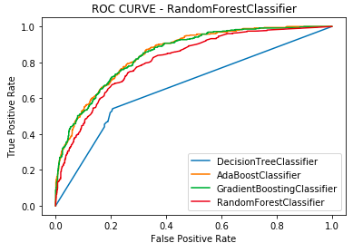
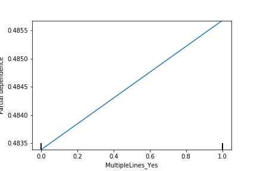

# CHURN MODEL

## The Problem 

In Telco business, there are customers who stop doing business with the entity occasionally. The rate of customers leaving is too high, and we want to (a) predict which customers are going to leave, (b) identify the factors causing the customers to leave.

## Value of the Problem

Special promos and good customer service can be offered to the customers who are going to leave. Also, if we understand the factors responsible for the churn rate, we can fix them and create a better experience for the customers.

## Project Roadmap
- **Data Cleaning**
- **Exploratory Data Analysis**
- **Data Modeling**
    - **Learning Curves**
    - **ROC Curves**
    - **Multi Collinearity**
    - **Hyperparameter Tuning**
- **Model Evaluation**

## Approach and Solution 
* Although there weren't any missing values, 'TotalCharges' had 8 empty string values. These were imputed with a value of 20.
* Featurize Data:
    - Dropped the CustomerId column
    - Transformed categorical features using OneHot Encoding
    - Addressed multicollinearity by dropping highly correlated features using a cutoff VIF  (Variacne Inflation Factor) of 10
* Built different models, and settled on AdaBoost model by plotting ROC Curves.

* Tried various hyper-parameter values, but ended up using the default parameters except for the learning rate. 

## Results

**Feature Importances**

* Tenure of the customer had a high impact on customer Churn - The longer the customer is with us, the less likely it is to churn.
*  The following customer attributes showed high Churn rate:
    - Multiple Lines
    - Payment method - Electronic Check
    - No Phone Service
    - Streaming TV and movies
    - Paperless Billing
    - Fiber optic Internet Service

* The following customer attributes were responsible for customer retention:
    - Having Online backup, security, and tech support
    - No internet service (Streaming Movies) 
    - One year or two year contracts
    - Payment method - Mail Check

## Evaluating Test Data
* Evaluated the test model and obtained a ROC_AUC score of 0.859.